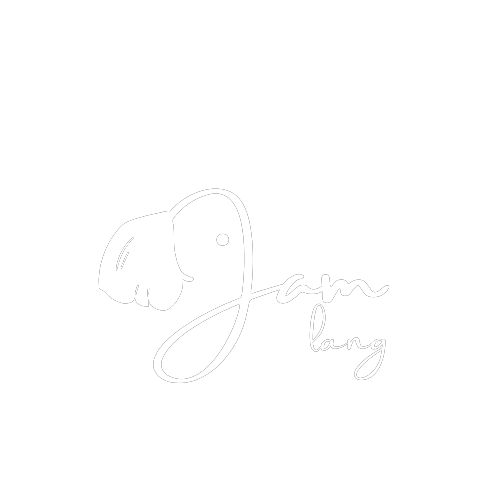

<h1 align="center">
   
    
    
  Jam Lang
   
   
</h1>

## Overview

It is a simple CLI based programming language that is written entirely in JAVA. It stores the variables in a hash table. It has a pretty simple and easy to learn syntax.  It has support for user-defined functions to avoid code repetition. It also comes with a minimal file I/O.

Author- [Arco Das](https://www.instagram.com/thearcodas)

---

## About The Author

[**Arco das**](https://www.instagram.com/thearcodas) is a student pursuing Bachelor of Science (Hons.) in the Computer Science Department of Scottish Church College, Kolkata. He is an Actor, Theatre Practitioner and a computer and programming geek.

His Social Handles : [Instagram](https://www.instagram.com/thearcodas) | [Facebook](https://www.facebook.com/thearcodas) | [Blog](https://www.thearcodas.wordpress.com)

---
The background color should be `#fa6559` for light mode and `#000000` for dark mode.

